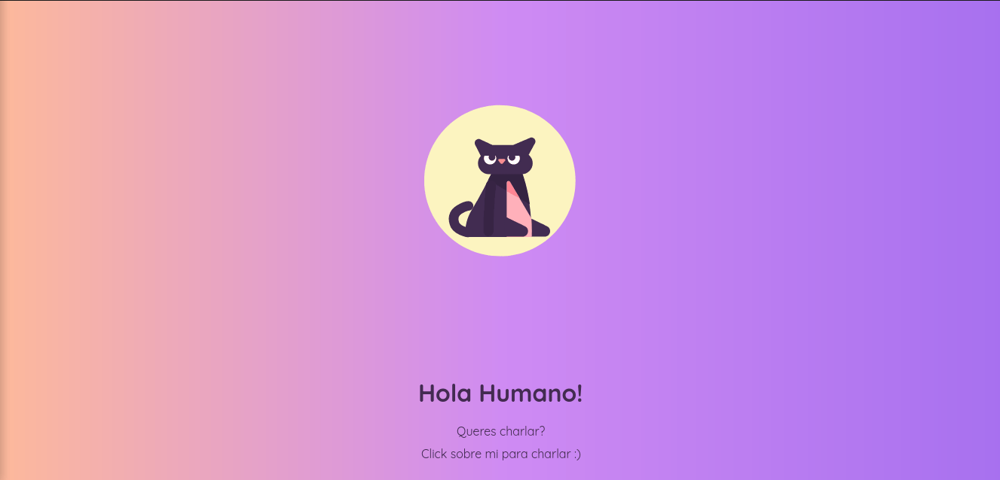
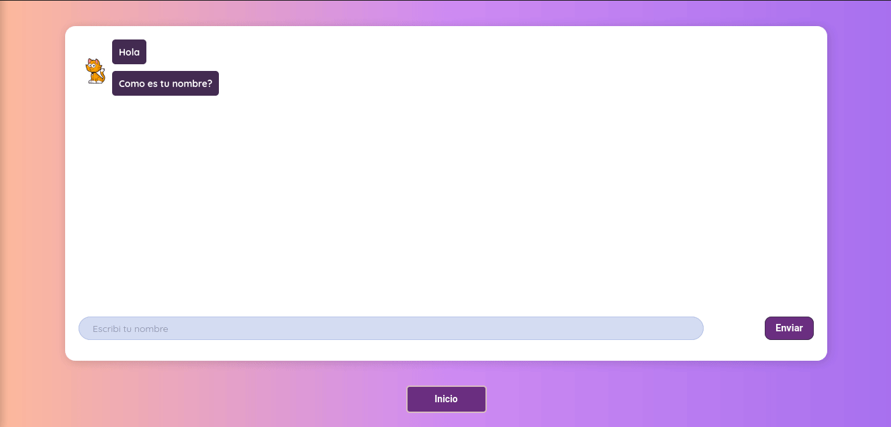
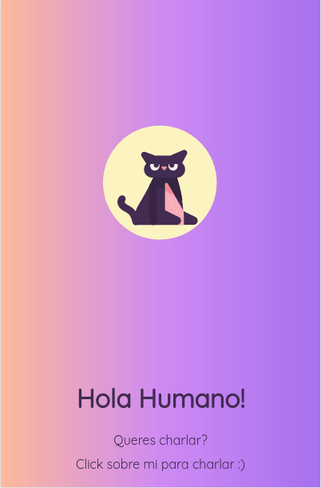

# Cat-Bot Simple

[](https://opensource.org/licenses/MIT)
 
<table>
<tr>
<td>
  A responsive web application that simulates a chat with a cat-bot with limited interactions.
</td>
</tr>
</table>

## Demo
Here is a working live demo : https://elegant-ride-71a168.netlify.app

## Site

### Home Page



### Chat Page




### Mobile support



## Installation


```shell
$ git clone git@github.com:facu-zerpa/cat-bot.git

$ cd cat-bot/catbot

$ npm install

$ npm start
```

## Library

- [Moment.js](https://momentjs.com/)
- [React Lottie](https://www.npmjs.com/package/react-lottie)
- [React Reveal](https://www.npmjs.com/package/react-reveal)
- [React Router DOM](https://www.npmjs.com/package/react-router-dom)

## License

 [](https://opensource.org/licenses/MIT)

- **[MIT license](http://opensource.org/licenses/mit-license.php)**
- Copyright 2020 © **Facundo Zerpa**
